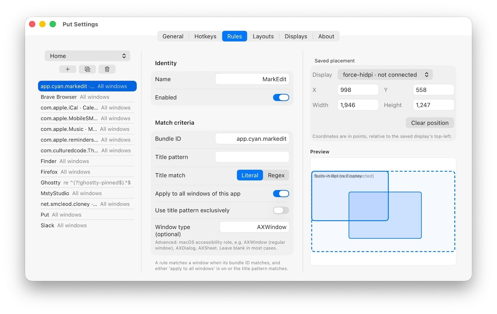

# Put

Put remembers and restores the display, size and position of windows when triggered by a hotkey or configurable events such as changing monitors, waking, or launching an app. Rules are display-independent, so they survive resolution, scale, and monitor replug changes without resaving.



## Requirements

- macOS 26.0 or later
- Grant accessibility permissions for the app to manage window positions and sizes
- For development: Swift toolchain (bundled with XCode), `swiftlint` and `swiftformat`

## Build and run

```shell
make            # build
make install    # install the signed bundle to /Applications
# or
make run        # build and launch the bundled app
```

## Layouts

A layout is a named set of window rules scoped to a screen configuration. Put keeps separate layouts for, say, "laptop only" versus "docked with external display", so the same app can have different saved placements per setup. Layouts are managed in Settings → Layouts, and each rule belongs to the layout selected in Settings → Rules. Each layout can also be given its own activation hotkey.

Saving respects the active layout's screen scope: a window on a monitor that isn't part of that layout's configuration is skipped rather than stamped in with an unrestorable rule, and the skip is reported so it isn't silent.

## Default hotkeys

| Action                              | Default    |
| ----------------------------------- | ---------- |
| Save focused window (all app windows) | `shift+F5` |
| Restore active window               | `F5`       |
| Save all windows                    | `shift+F6` |
| Restore all windows                 | `F6`       |

Saving the focused window stamps a rule that applies to every window of the frontmost app. A separate "save focused window (this title only)" action is available with no default binding. All hotkeys, plus per-layout activation shortcuts, are editable from Settings → Hotkeys.

## Permissions

Put needs the Accessibility permission to query and move windows in other applications. On first launch a multi-step welcome wizard introduces the core concepts, drives the Accessibility grant, and surfaces the launch-at-login and restore-on-launch defaults.

The wizard can be re-opened later from Settings → General → "Show welcome again..." or from the menu bar's "Welcome..." item. Re-running it never overwrites existing settings.

If permission state gets into a weird condition during development (typical after rebuilds change the binary hash), reset it:

```shell
tccutil reset Accessibility net.smcleod.put
```

---

### Development
```shell
make test       # hermetic unit tests
make test-ax    # integration tests requiring Accessibility (PUT_RUN_AX_TESTS=1)

make lint       # swiftlint + swiftformat
make bundle     # build, assemble and sign ./Put.app

make clean      # remove .build/ and Put.app/
```

- `make setup-dev-signing` store an Apple Development identity in the Keychain (one-time).
- `make setup-signing` lists the codesign identities available on the machine.
- `make bundle` signs the app as part of the build. By default it signs ad-hoc, which revokes the Accessibility grant on every rebuild because the binary hash changes. For development, sign with a stable Apple Development certificate once so the grant persists.

### Distribution

Put is distributed as a Developer ID signed, notarised `.app`.

## License

Copyright © 2026 Sam McLeod. All rights reserved.
